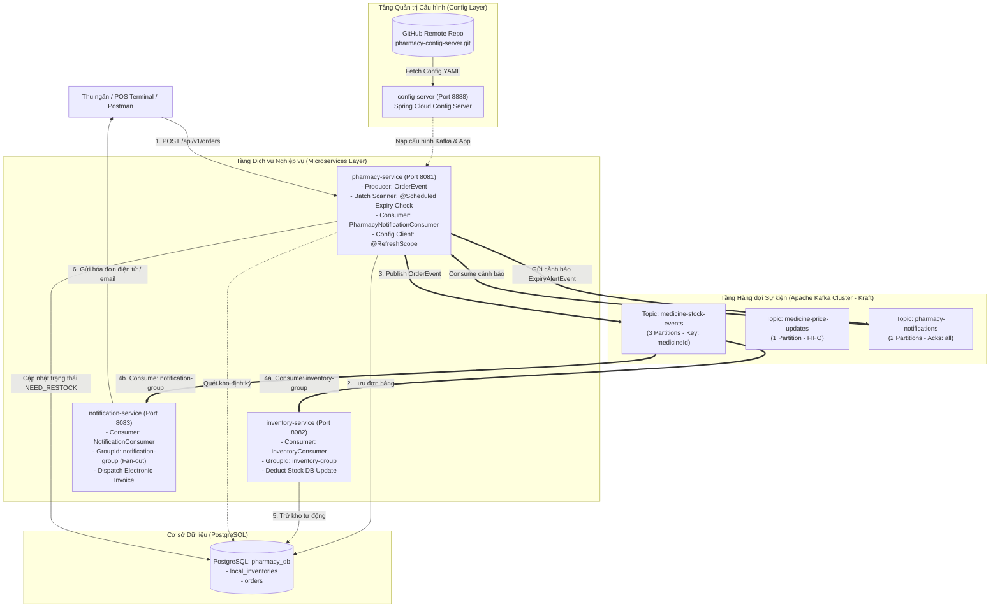

# Hệ Thống Microservices Quản Trị Chuỗi Hiệu Thuốc (Pharmacy Event-Driven Microservices)

Hệ thống quản lý chuỗi hiệu thuốc theo kiến trúc **Event-Driven Microservices** hiện đại, kết hợp **Apache Kafka (Kraft)**, **Spring Cloud Config Server** (đồng bộ Git từ xa), **Dynamic Configuration Refresh** (`@RefreshScope`), **Distributed Tracing & MDC Logging** (`X-Correlation-Id`), kiến trúc chuẩn **WebMVC**, **Pagination** cho các API danh sách, và cơ chế bảo đảm độ tin cậy giao dịch (**Acks = all**, **Retries**, **Idempotent Updates**).

---

## 1. Sơ đồ kiến trúc Event-Driven tổng thể (System Architecture)



---

## 2. Bảng tổng hợp các dịch vụ (Service Matrix)

| Dịch vụ / Module | Cổng (Port) | Cơ sở dữ liệu | Trách nhiệm chính trong hệ thống | Đường dẫn module |
| :--- | :---: | :---: | :--- | :--- |
| **`config-server`** | `8888` | Không | Máy chủ phân phối cấu hình tập trung từ GitHub repository | [`config-server`](file:///home/trgphun/projects/personal/rikkei/module4/pharmacy-services/config-server) |
| **`pharmacy-service`** | `8081` | `pharmacy_db` (PostgreSQL) | Bán thuốc, xuất bản sự kiện đơn hàng, quét kho hết hạn và cập nhật trạng thái thuốc | [`pharmacy-service`](file:///home/trgphun/projects/personal/rikkei/module4/pharmacy-services/pharmacy-service) |
| **`inventory-service`** | `8082` | `pharmacy_db` (PostgreSQL) | Lắng nghe `medicine-stock-events`, tự động trừ tồn kho nguyên tử (Atomic Update) | [`inventory-service`](file:///home/trgphun/projects/personal/rikkei/module4/pharmacy-services/inventory-service) |
| **`notification-service`** | `8083` | In-Memory / Log | Lắng nghe `medicine-stock-events` theo mô hình Fan-out, gửi hóa đơn điện tử cho khách | [`notification-service`](file:///home/trgphun/projects/personal/rikkei/module4/pharmacy-services/notification-service) |
| **`pharmacy-config-server`** | Git Repo | Git Versioning | Kho lưu trữ cấu hình Git từ xa: [`pharmacy-service.yaml`](file:///home/trgphun/projects/personal/rikkei/module4/pharmacy-config-server/pharmacy-service.yaml) | [GitHub Repository](https://github.com/phuongtv275/pharmacy-config-server.git) |

---

## 3. Ma trận triển khai 6 bài tập (Plan / Exercises Matrix)

Toàn bộ 6 bài tập trong thư mục [`plan/`](file:///home/trgphun/projects/personal/rikkei/module4/pharmacy-services/plan) đã được triển khai và kiểm thử thực tế thành công:

| Bài tập | Tiêu đề | Giải pháp kỹ thuật | Trạng thái | Mã nguồn liên quan |
| :---: | :--- | :--- | :---: | :--- |
| [**Bài 1**](file:///home/trgphun/projects/personal/rikkei/module4/pharmacy-services/plan/exercise01.md) | Thiết lập hạ tầng và Quản lý Topic dược phẩm | Khởi tạo Kafka Docker Kraft; Tạo 3 topics: `medicine-stock-events` (3 partitions), `medicine-price-updates` (1 partition), `pharmacy-notifications` (2 partitions) | Đã hoàn thành | [`KafkaTopicConfig`](file:///home/trgphun/projects/personal/rikkei/module4/pharmacy-services/pharmacy-service/src/main/java/com/example/pharmacyservice/config/KafkaTopicConfig.java) |
| [**Bài 2**](file:///home/trgphun/projects/personal/rikkei/module4/pharmacy-services/plan/exercise02.md) | Triển khai Producer gửi sự kiện Đơn hàng thuốc | `KafkaTemplate` JSON serializer; Message key là `medicineId` phân phối đơn hàng cùng loại thuốc vào cùng một Partition; API bán thuốc tạo `Order` | Đã hoàn thành | [`OrderKafkaProducer`](file:///home/trgphun/projects/personal/rikkei/module4/pharmacy-services/pharmacy-service/src/main/java/com/example/pharmacyservice/producer/OrderKafkaProducer.java)<br/>[`OrderController`](file:///home/trgphun/projects/personal/rikkei/module4/pharmacy-services/pharmacy-service/src/main/java/com/example/pharmacyservice/controller/OrderController.java) |
| [**Bài 3**](file:///home/trgphun/projects/personal/rikkei/module4/pharmacy-services/plan/exercise03.md) | Triển khai Consumer cập nhật kho dược tự động | `inventory-service` lắng nghe topic `medicine-stock-events` với `groupId = inventory-group`; Thực hiện Atomic query: `UPDATE local_inventories SET local_stock_quantity = local_stock_quantity - quantity` | Đã hoàn thành | [`InventoryConsumer`](file:///home/trgphun/projects/personal/rikkei/module4/pharmacy-services/inventory-service/src/main/java/com/example/inventoryservice/consumer/InventoryConsumer.java)<br/>[`InventoryRepository`](file:///home/trgphun/projects/personal/rikkei/module4/pharmacy-services/inventory-service/src/main/java/com/example/inventoryservice/repository/InventoryRepository.java) |
| [**Bài 4**](file:///home/trgphun/projects/personal/rikkei/module4/pharmacy-services/plan/exercise04.md) | Giao tiếp hướng sự kiện (Fan-out) gửi thông báo | `notification-service` lắng nghe song song topic `medicine-stock-events` với `groupId = notification-group`; In log và điều hướng hóa đơn điện tử cho khách hàng | Đã hoàn thành | [`NotificationConsumer`](file:///home/trgphun/projects/personal/rikkei/module4/pharmacy-services/notification-service/src/main/java/com/example/notificationservice/consumer/NotificationConsumer.java)<br/>[`NotificationServiceImpl`](file:///home/trgphun/projects/personal/rikkei/module4/pharmacy-services/notification-service/src/main/java/com/example/notificationservice/service/impl/NotificationServiceImpl.java) |
| [**Bài 5**](file:///home/trgphun/projects/personal/rikkei/module4/pharmacy-services/plan/exercise05.md) | Cập nhật cấu hình Kafka từ xa (Config Server) | Đẩy các tham số Kafka (`bootstrap-servers`, `template.default-topic`, `acks=all`, `retries=3`) lên remote Git repository; Dùng `@RefreshScope` và nạp động vào `@Value` | Đã hoàn thành | [Git Config `pharmacy-service.yaml`](file:///home/trgphun/projects/personal/rikkei/module4/pharmacy-config-server/pharmacy-service.yaml)<br/>[`OrderKafkaProducer`](file:///home/trgphun/projects/personal/rikkei/module4/pharmacy-services/pharmacy-service/src/main/java/com/example/pharmacyservice/producer/OrderKafkaProducer.java) |
| [**Bài 6**](file:///home/trgphun/projects/personal/rikkei/module4/pharmacy-services/plan/exercise06.md) | Cảnh báo thuốc sắp hết hạn (Chế độ thực tế) | `@Scheduled` quét kho định kỳ; Gửi sự kiện vào topic `pharmacy-notifications` với `acks=all`; Consumer tự động đổi trạng thái thuốc sang `NEED_RESTOCK` trong DB và gửi email cho Quản lý | Đã hoàn thành | [`MedicineExpiryBatchScheduler`](file:///home/trgphun/projects/personal/rikkei/module4/pharmacy-services/pharmacy-service/src/main/java/com/example/pharmacyservice/scheduler/MedicineExpiryBatchScheduler.java)<br/>[`PharmacyNotificationConsumer`](file:///home/trgphun/projects/personal/rikkei/module4/pharmacy-services/pharmacy-service/src/main/java/com/example/pharmacyservice/consumer/PharmacyNotificationConsumer.java) |

---

## 4. Tuân thủ bộ quy chuẩn lập trình ([`AGENTS.md`](file:///home/trgphun/projects/personal/rikkei/module4/pharmacy-services/AGENTS.md))

1. **Cấu trúc WebMVC chuẩn:** Tất cả module đều được phân tầng: Controller -> Service -> Repository -> Entity / DTO.
2. **Distributed Tracing & Correlation ID:** Mọi request và log đều được gắn kèm mã `X-Correlation-Id` qua [`CorrelationIdFilter`](file:///home/trgphun/projects/personal/rikkei/module4/pharmacy-services/pharmacy-service/src/main/java/com/example/pharmacyservice/filter/CorrelationIdFilter.java).
3. **DTO Validation nghiêm ngặt:** Request DTO đều áp dụng Bean Validation (`@NotBlank`, `@NotNull`, `@Min`, `@Email`).
4. **Xử lý ngoại lệ tập trung:** [`GlobalExceptionHandler`](file:///home/trgphun/projects/personal/rikkei/module4/pharmacy-services/pharmacy-service/src/main/java/com/example/pharmacyservice/exception/GlobalExceptionHandler.java) tại tất cả các module.
5. **Phân trang bắt buộc cho các API GET:**
   - `GET /api/v1/orders?page=0&size=10`
   - `GET /api/v1/inventory?page=0&size=10`
   - `GET /api/v1/notifications?page=0&size=10`

---

## 5. Hướng dẫn kiểm thử thực tế (Testing & Verification Guide)

### 5.1. Khởi động hạ tầng Docker
```bash
docker compose up -d
```

### 5.2. Khởi động các Microservices theo thứ tự
1. **Config Server (Port 8888):**
   ```bash
   cd config-server && ./gradlew bootRun
   ```
2. **Pharmacy Service (Port 8081):**
   ```bash
   cd pharmacy-service && ./gradlew bootRun
   ```
3. **Inventory Service (Port 8082):**
   ```bash
   cd inventory-service && ./gradlew bootRun
   ```
4. **Notification Service (Port 8083):**
   ```bash
   cd notification-service && ./gradlew bootRun
   ```

### 5.3. Kịch bản kiểm thử tích hợp (End-to-End Test)

#### Kịch bản 1: Bán thuốc & Fan-out Events (Bài 2, 3, 4)
```bash
curl -X POST http://localhost:8081/api/v1/orders \
  -H "Content-Type: application/json" \
  -H "X-Correlation-Id: test-order-cid-001" \
  -d '{
    "medicineId": "PARA500",
    "quantity": 5,
    "customerName": "Nguyen Van A",
    "customerEmail": "nguyenvana@gmail.com"
  }'
```
- **Kết quả tại `pharmacy-service`:** Lưu đơn hàng vào DB và gửi `OrderEvent` với message key `PARA500`.
- **Kết quả tại `inventory-service`:** Nhận event, trừ tồn kho thuốc `PARA500` từ `150` xuống `145`.
- **Kết quả tại `notification-service`:** Nhận event, in dòng log: `"Hóa đơn cho đơn hàng [ORD-xxxx] đã được gửi tới khách hàng"`.

#### Kịch bản 2: Tra cứu danh sách phân trang (Quy chuẩn AGENTS.md)
```bash
# Danh sách đơn hàng tại pharmacy-service
curl -s "http://localhost:8081/api/v1/orders?page=0&size=5"

# Danh sách kho dược tại inventory-service
curl -s "http://localhost:8082/api/v1/inventory?page=0&size=5"

# Lịch sử thông báo tại notification-service
curl -s "http://localhost:8083/api/v1/notifications?page=0&size=5"
```

#### Kịch bản 3: Cảnh báo thuốc sắp hết hạn (Bài 6)
Quét kho định kỳ tự động chạy mỗi 60 giây (hoặc có thể kích hoạt thủ công ngay lập tức qua API):
```bash
curl -X POST http://localhost:8081/api/v1/batch/scan-expiry
```
- Phát hiện thuốc `AMOX500` còn 15 ngày hết hạn.
- Gửi cảnh báo lên topic `pharmacy-notifications`.
- Consumer bắt sự kiện, cập nhật trạng thái `status: NEED_RESTOCK` cho thuốc `AMOX500` trong PostgreSQL và gửi email thông báo cho Quản lý hiệu thuốc.
