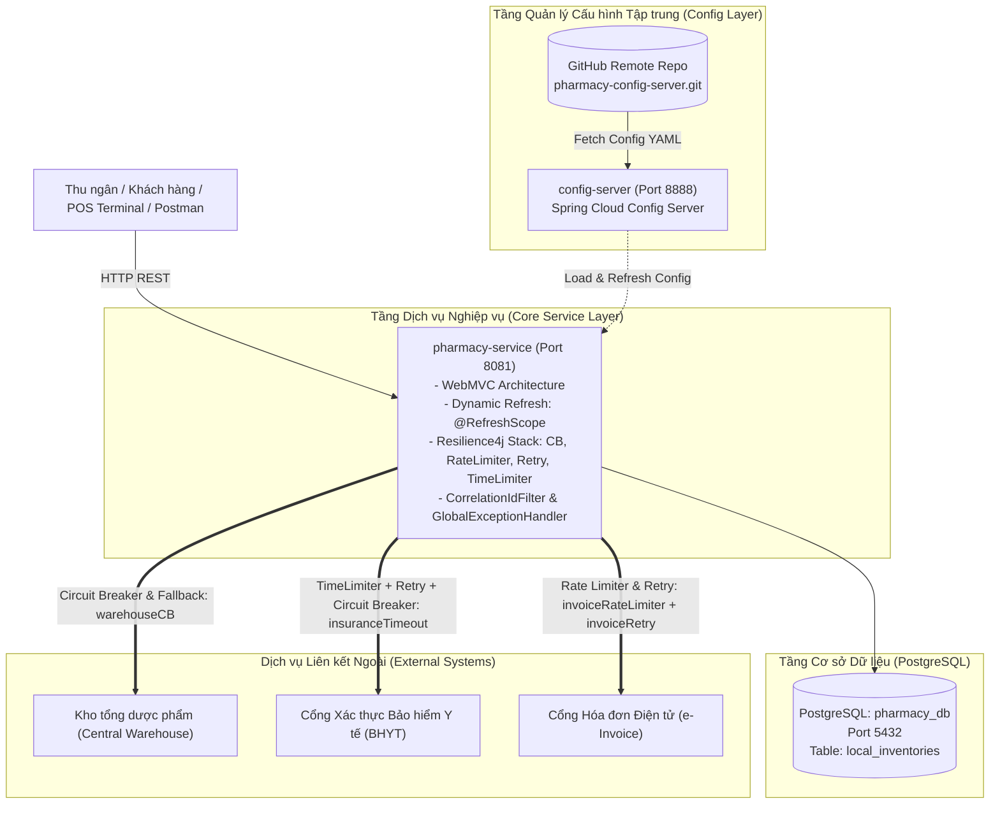

# Hệ Thống Microservices Quản Trị Chuỗi Hiệu Thuốc (Pharmacy Services System)

Hệ thống quản lý chuỗi hiệu thuốc hiện đại theo kiến trúc **Spring Cloud Microservices**, áp dụng các mẫu thiết kế chuẩn enterprise: **Spring Cloud Config Server** (đồng bộ từ xa qua Git), **Dynamic Configuration Refresh** (`@RefreshScope` & Spring Boot Actuator), **Distributed Tracing & MDC Logging** (`X-Correlation-Id`), kiến trúc chuẩn **WebMVC**, **Pagination** cho các API danh sách, và bộ giải pháp toàn diện về **Fault Tolerance & Resilience (Resilience4j: Circuit Breaker, Fallback, Rate Limiter, Retry, TimeLimiter)**.

---

## 1. Sơ đồ kiến trúc tổng thể (System Architecture)



---

## 2. Bảng tổng hợp các dịch vụ (Service Matrix)

| Dịch vụ / Module | Cổng (Port) | Cơ sở dữ liệu | Trách nhiệm chính & Cơ chế bảo vệ | Đường dẫn module |
| :--- | :---: | :---: | :--- | :--- |
| **`config-server`** | `8888` | Không | Máy chủ phân phối cấu hình tập trung từ GitHub repository | [`config-server`](file:///home/trgphun/projects/personal/rikkei/module4/pharmacy-services/config-server) |
| **`pharmacy-service`** | `8081` | `pharmacy_db` (PostgreSQL) | Dịch vụ bán thuốc, tính hóa đơn, kiểm tra kho, xác thực BHYT và xuất hóa đơn | [`pharmacy-service`](file:///home/trgphun/projects/personal/rikkei/module4/pharmacy-services/pharmacy-service) |
| **`pharmacy-config-server`** | Git Repo | Git Versioning | Kho lưu trữ cấu hình Git từ xa: [`pharmacy-service.yaml`](file:///home/trgphun/projects/personal/rikkei/module4/pharmacy-config-server/pharmacy-service.yaml) | [GitHub Repository](https://github.com/phuongtv275/pharmacy-config-server.git) |

---

## 3. Ma trận triển khai 6 bài tập (Plan / Exercises Matrix)

Toàn bộ 6 bài tập trong thư mục [`plan/`](file:///home/trgphun/projects/personal/rikkei/module4/pharmacy-services/plan) đã được triển khai và kiểm thử thực tế thành công:

| Bài tập | Tiêu đề | Giải pháp kỹ thuật | Trạng thái | Mã nguồn liên quan |
| :---: | :--- | :--- | :---: | :--- |
| [**Bài 1**](file:///home/trgphun/projects/personal/rikkei/module4/pharmacy-services/plan/exercise01.md) | Quản trị cấu hình tập trung cho Chuỗi hiệu thuốc | Spring Cloud Config Server + Git Remote + `@Value` nạp chi nhánh, hotline & DB | Đã hoàn thành | [`PharmacyStartupRunner`](file:///home/trgphun/projects/personal/rikkei/module4/pharmacy-services/pharmacy-service/src/main/java/com/example/pharmacyservice/runner/PharmacyStartupRunner.java) |
| [**Bài 2**](file:///home/trgphun/projects/personal/rikkei/module4/pharmacy-services/plan/exercise02.md) | Cập nhật giá thuốc "Nóng" không Restart | Spring Boot Actuator + `@RefreshScope` nạp thuế VAT mới qua `/actuator/refresh` | Đã hoàn thành | [`BillController`](file:///home/trgphun/projects/personal/rikkei/module4/pharmacy-services/pharmacy-service/src/main/java/com/example/pharmacyservice/controller/BillController.java) |
| [**Bài 3**](file:///home/trgphun/projects/personal/rikkei/module4/pharmacy-services/plan/exercise03.md) | Triển khai Circuit Breaker cho Kiểm tra kho thuốc | Resilience4j `@CircuitBreaker(name = "warehouseCB")`, ngắt mạch sang `OPEN` khi lỗi > 50% | Đã hoàn thành | [`WarehouseServiceImpl`](file:///home/trgphun/projects/personal/rikkei/module4/pharmacy-services/pharmacy-service/src/main/java/com/example/pharmacyservice/service/impl/WarehouseServiceImpl.java) |
| [**Bài 4**](file:///home/trgphun/projects/personal/rikkei/module4/pharmacy-services/plan/exercise04.md) | Phương án dự phòng Fallback khi mất kết nối kho tổng | `fallbackMethod = "checkWarehouseFallback"`, tự động dùng tồn kho cục bộ `local_inventories` | Đã hoàn thành | [`WarehouseServiceImpl`](file:///home/trgphun/projects/personal/rikkei/module4/pharmacy-services/pharmacy-service/src/main/java/com/example/pharmacyservice/service/impl/WarehouseServiceImpl.java#L78-L113) |
| [**Bài 5**](file:///home/trgphun/projects/personal/rikkei/module4/pharmacy-services/plan/exercise05.md) | Giới hạn số lượng đơn thuốc và Tự động thử lại | Resilience4j `@RateLimiter` (tối đa 5 hóa đơn / 10s) & `@Retry` (thử lại 3 lần, cách 2s) | Đã hoàn thành | [`InvoiceServiceImpl`](file:///home/trgphun/projects/personal/rikkei/module4/pharmacy-services/pharmacy-service/src/main/java/com/example/pharmacyservice/service/impl/InvoiceServiceImpl.java) |
| [**Bài 6**](file:///home/trgphun/projects/personal/rikkei/module4/pharmacy-services/plan/exercise06.md) | Hệ thống bán thuốc tự phục hồi toàn diện | Full Resilience: TimeLimiter (3s $\rightarrow$ 1s qua Git) + Retry (3 lần) + CB (60%) + Fallback giá gốc | Đã hoàn thành | [`InsuranceServiceImpl`](file:///home/trgphun/projects/personal/rikkei/module4/pharmacy-services/pharmacy-service/src/main/java/com/example/pharmacyservice/service/impl/InsuranceServiceImpl.java) |

---

## 4. Tuân thủ bộ quy chuẩn lập trình ([`AGENTS.md`](file:///home/trgphun/projects/personal/rikkei/module4/pharmacy-services/AGENTS.md))

1. **Cấu trúc WebMVC chuẩn:** Tổ chức mã nguồn phân tách rõ ràng:
   * `com.example.pharmacyservice.controller`: Tiếp nhận request HTTP, validate và trả về `ResponseEntity`.
   * `com.example.pharmacyservice.service`: Chứa nghiệp vụ kinh doanh, áp dụng các annotation Resilience4j.
   * `com.example.pharmacyservice.repository`: Giao tiếp cơ sở dữ liệu qua Spring Data JPA.
   * `com.example.pharmacyservice.entity`: Khai báo bảng ORM (`Inventory`).
   * `com.example.pharmacyservice.dto`: Request/Response tách biệt (`BillRequest`, `InvoiceRequest`, `StockCheckRequest`, `InsuranceVerificationRequest`).
2. **Distributed Tracing & Developer Debugging:**
   * [`CorrelationIdFilter`](file:///home/trgphun/projects/personal/rikkei/module4/pharmacy-services/pharmacy-service/src/main/java/com/example/pharmacyservice/filter/CorrelationIdFilter.java): Tự động gán hoặc sinh mới `X-Correlation-Id`, đưa vào SLF4J `MDC` để xuất hiện trên tất cả các dòng log console:
     `%d{yyyy-MM-dd HH:mm:ss.SSS} [%thread] %-5level [cid:%X{correlationId:-N/A}] %logger{36} - %msg%n`
   * [`ResilienceEventLogger`](file:///home/trgphun/projects/personal/rikkei/module4/pharmacy-services/pharmacy-service/src/main/java/com/example/pharmacyservice/config/ResilienceEventLogger.java): Lắng nghe và ghi log khi Circuit Breaker chuyển trạng thái (`CLOSED -> OPEN -> HALF_OPEN`), log từng lần Retry và log khi Rate Limiter từ chối request.
3. **DTO Validation nghiêm ngặt:** Toàn bộ Request DTO đều có validation (`@NotBlank`, `@NotNull`, `@Min`, `@DecimalMin`, `@Valid`).
4. **Xử lý ngoại lệ tập trung:** [`GlobalExceptionHandler`](file:///home/trgphun/projects/personal/rikkei/module4/pharmacy-services/pharmacy-service/src/main/java/com/example/pharmacyservice/exception/GlobalExceptionHandler.java) bắt lỗi Validation, `RequestNotPermitted` (HTTP 429), `CallNotPermittedException` (HTTP 503), `TimeoutException` (HTTP 504), đóng gói chuẩn theo envelope [`ApiResponse`](file:///home/trgphun/projects/personal/rikkei/module4/pharmacy-services/pharmacy-service/src/main/java/com/example/pharmacyservice/dto/response/ApiResponse.java).
5. **Phân trang bắt buộc cho các API GET:**
   * `GET /api/v1/bills?page=0&size=10`
   * `GET /api/v1/warehouse/inventory?page=0&size=10`
   * `GET /api/v1/invoices?page=0&size=10`
   * `GET /api/v1/insurance/history?page=0&size=10`

---

## 5. Hướng dẫn khởi chạy hệ thống (Run & Verification Guide)

### 5.1. Khởi động cơ sở dữ liệu PostgreSQL
Đảm bảo PostgreSQL đang chạy trên cổng `5432` và database `pharmacy_db` đã được tạo:
```bash
docker exec rikkei_postgres psql -U rikkei -d postgres -c "CREATE DATABASE pharmacy_db OWNER rikkei;"
```

### 5.2. Khởi động `config-server` (Port 8888)
```bash
cd config-server
./gradlew bootRun
```
* Kiểm tra Config Server đã đọc cấu hình từ GitHub:
```bash
curl -s http://localhost:8888/pharmacy-service/default
```

### 5.3. Khởi động `pharmacy-service` (Port 8081)
```bash
cd pharmacy-service
./gradlew bootRun
```
* Khi khởi động thành công, log hệ thống sẽ hiển thị thông tin chi nhánh:
```text
================================================================================
🚀 [PHARMACY-SERVICE] KHỞI ĐỘNG THÀNH CÔNG VỚI SPRING CLOUD CONFIG SERVER!
📍 Chi nhánh hiệu thuốc : Nha Thuoc So 1
📞 Hotline hỗ trợ        : 1900 9999
🗄️ Database kết nối      : jdbc:postgresql://localhost:5432/pharmacy_db
================================================================================
```

---

## 6. Kịch bản kiểm thử mẫu (cURL Cheatsheet)

### 6.1. Bài 1: Xem thông tin chi nhánh
```bash
curl -s http://localhost:8081/api/v1/branch
```

### 6.2. Bài 2: Tính tiền hóa đơn & Dynamic Refresh VAT
1. Tính tiền với VAT hiện tại:
```bash
curl -s -X POST http://localhost:8081/api/v1/bill \
  -H "Content-Type: application/json" \
  -d '{
    "customerName": "Nguyen Van A",
    "items": [
      {"medicineName": "Paracetamol 500mg", "quantity": 2, "unitPrice": 50000},
      {"medicineName": "Vitamin C 1000mg", "quantity": 1, "unitPrice": 100000}
    ]
  }'
```
2. Cập nhật VAT từ `0.10` thành `0.08` trên Git repo, push và gọi refresh:
```bash
curl -s -X POST http://localhost:8081/actuator/refresh
```
3. Gọi lại API tính tiền ở bước 1: Thuế 8% áp dụng ngay lập tức mà **không cần khởi động lại ứng dụng**.

### 6.3. Bài 3 & 4: Circuit Breaker & Fallback Kiểm tra kho
1. Kiểm tra tồn kho bình thường (Kho tổng):
```bash
curl -s -X POST http://localhost:8081/api/v1/warehouse/check-stock \
  -H "Content-Type: application/json" \
  -d '{"medicineCode": "PARA500", "quantity": 10}'
```
2. Giả lập kho tổng bị sập:
```bash
curl -s -X POST "http://localhost:8081/api/v1/warehouse/simulate-outage?down=true"
```
3. Gọi kiểm tra 5 lần liên tiếp:
   * Mạch ngắt sang `OPEN` (Fail-fast trong 5ms).
   * Fallback kích hoạt, tự động tra cứu tồn kho cục bộ `local_inventories` và trả về thông báo:
     > *"Không thể kết nối kho tổng. Hệ thống sẽ sử dụng dữ liệu tồn kho cục bộ để tiếp tục giao dịch"*
4. Khôi phục kho tổng:
```bash
curl -s -X POST "http://localhost:8081/api/v1/warehouse/simulate-outage?down=false"
```

### 6.4. Bài 5: Rate Limiter & Retry Xuất hóa đơn
1. Kiểm tra Rate Limiter (bấm xuất liên tiếp 7 lần):
```bash
for i in {1..7}; do
  curl -s -X POST http://localhost:8081/api/v1/invoices \
    -H "Content-Type: application/json" \
    -d '{"posTerminalId": "POS-01", "customerName": "Customer '$i'", "items": [{"medicineName": "Paracetamol", "quantity": 1, "unitPrice": 50000}]}'
done
```
* Từ lần thứ 6 trở đi, request bị chặn ngay (HTTP 429): `"Thao tác quá nhanh! Máy bán thuốc chỉ được phép xuất tối đa 5 hóa đơn trong 10 giây."`
2. Kiểm tra Retry (tự động thử lại 3 lần, mỗi lần cách 2 giây):
```bash
# Thiết lập mạng lỗi 2 lần đầu
curl -s -X POST "http://localhost:8081/api/v1/invoices/simulate-flaky-network?failTimes=2"

# Gửi yêu cầu xuất hóa đơn
curl -s -X POST http://localhost:8081/api/v1/invoices \
  -H "Content-Type: application/json" \
  -d '{"posTerminalId": "POS-02", "customerName": "Customer Retry", "items": [{"medicineName": "Amoxicillin", "quantity": 1, "unitPrice": 120000}]}'
```
* Hệ thống tự động thử lại 2 lần (sau 2s và 4s) và xuất thành công ở lần thứ 3 (`attemptCount: 3`).

### 6.5. Bài 6: Full Resilience Xác thực thẻ BHYT
1. Xác thực bình thường (delay 200ms < timeout 3s):
```bash
curl -s -X POST "http://localhost:8081/api/v1/insurance/verify?delayMs=200" \
  -H "Content-Type: application/json" \
  -d '{"patientName": "Tran Thi C", "insuranceCardNumber": "DN4010123456789", "prescriptionCode": "RX-01", "medicineTotalAmount": 500000}'
```
* Chiết khấu 80% BHYT thành công (`finalAmount: 100,000`).
2. Máy chủ bảo hiểm phản hồi chậm (delay 4000ms > timeout 3s):
```bash
curl -s -X POST "http://localhost:8081/api/v1/insurance/verify?delayMs=4000" \
  -H "Content-Type: application/json" \
  -d '{"patientName": "Tran Thi C", "insuranceCardNumber": "DN4010123456789", "prescriptionCode": "RX-01", "medicineTotalAmount": 500000}'
```
* Tự ngắt sau đúng 3s, Fallback trả về giá thuốc chưa chiết khấu (`finalAmount: 500,000`) kèm ghi chú `"Xác thực bảo hiểm sau"`.
3. Kiểm tra trạng thái Circuit Breaker BHYT:
```bash
curl -s http://localhost:8081/api/v1/insurance/circuit-breaker-state
```
